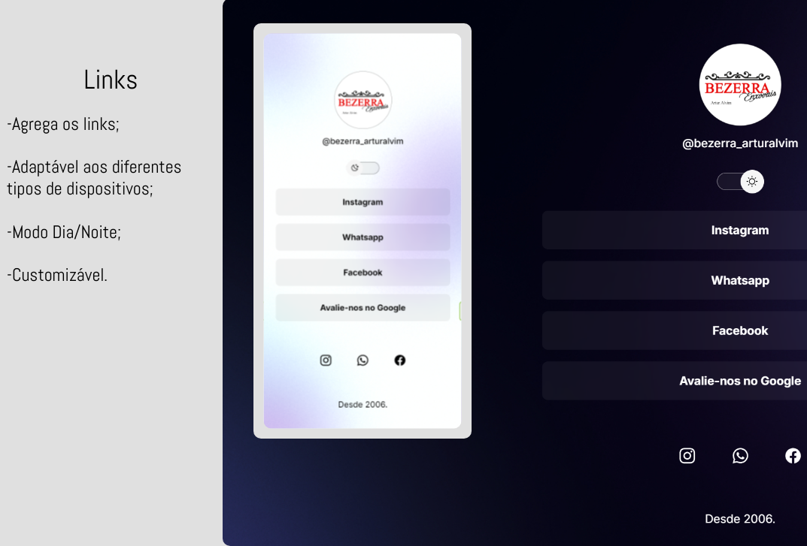

<h1 align="center">Links</h1>

   Programa criado para a loja Bezerra Enxovais .

  

## Tecnologias

Esse projeto foi desenvolvido com as seguintes tecnologias:

- HTML e CSS
- JavaScript
- Git e GitHub

O Links é um agregador de links para ser usado como cartão de visitas online.

## Licença : padrão.
